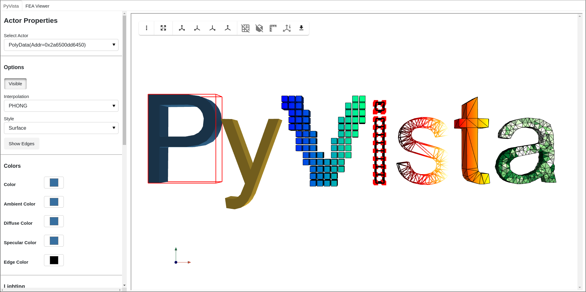

### Using PyVista & Trame with Panel



This is an example of using [PyVista](https://docs.pyvista.org/) & [Trame](https://kitware.github.io/trame/) with [Panel](https://panel.holoviz.org/). It's designed to be able to be deployed on the cloud (e.g. [GCP](https://cloud.google.com/)) as a containerized application that only relies on a single port being exposed .

Normally, Trame requires you to open up a second port in addition to the default to the Panel port, but here we use [jupyter-server-proxy](https://github.com/jupyterhub/jupyter-server-proxy) to proxy the traffic to an endpoint of our choosing, in this case, `/proxy`. This way, we can get the benefits of using the Trame with PyVista and being able to deploy on the cloud.

While, Panel already has a [VTK](https://panel.holoviz.org/reference/panes/VTK.html) extension, it uses an old serializer, meaning you'll be missing out in all the latest changes from Trame.

### Running the Application Locally

You can run the application locally with and without Docker.

#### With Docker Compose

```bash
make build
make serve-docker
```

Visit http://localhost:8080


#### Without Docker

```bash
pip install -r app/requirements.txt
pip install setuptools pyvista
make serve
```

Note the two extra requirements since they're normally included in the docker image.

Visit http://localhost:8080

### Development

This repository uses `pip-compile` to generate a `requirements.txt` file from
`requirements.in`, locking down your requirements given a set of
dependencies. This is used to ensure that the version of all of your
requirements (e.g. dependencies of dependencies) do not change when the docker
image is built. Run this with:

```bash
pip install pip-tools
make compile-requirements
```

### Deployment on the Cloud

This app is designed to be hosted as a containerized application on the cloud.

This application can be deployed on major cloud providers by either generating
and deploying the docker image, or in the case of GCP, simply running `gcloud
run deploy` and deploying directly from source, as can be useful in
development.

Here's an example:

```bash
gcloud run deploy pyvista-demo --source=/home/user/source/panel-example --region=us-central1 --project=reliable-house-439292-m4
```

